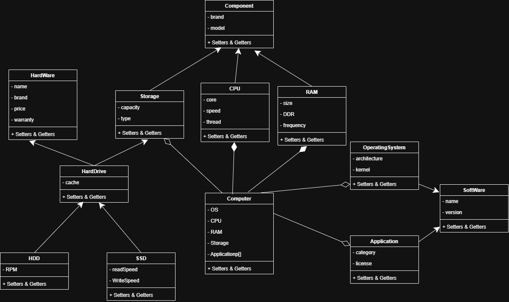
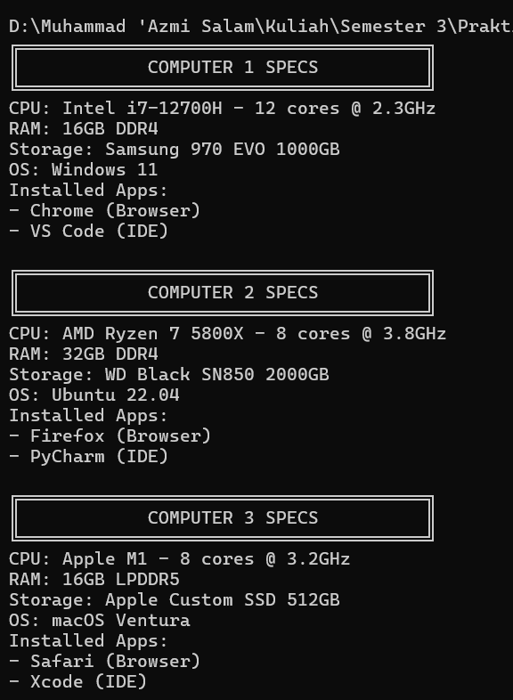
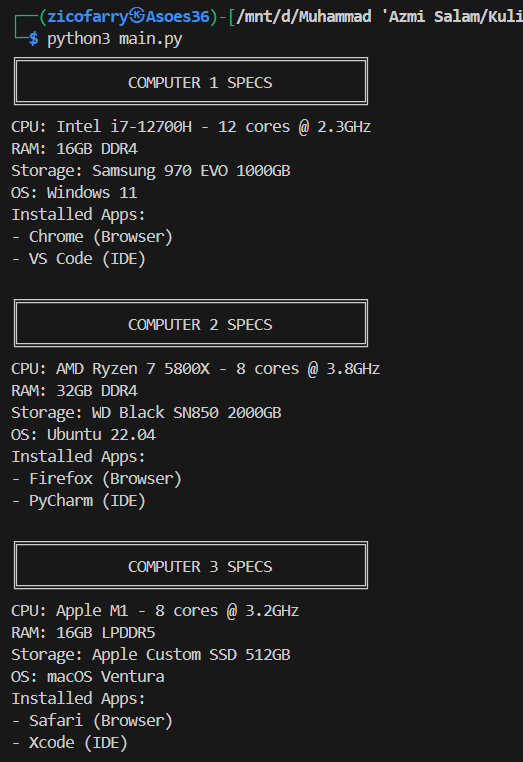

# Janji
Saya Muhammad 'Azmi Salam dengan NIM 2406010 mengerjakan Tugas Praktikum 2 pada Mata Kuliah Desain dan Pemrograman Berorientasi Objek (DPBO) untuk keberkahan-Nya maka saya tidak melakukan kecurangan seperti yang telah dispesifikasikan. Aamiin

# Struktur File
```
Main
├── CPP/
│   ├── Program/
│   │   ├── Electronic.cpp
│   │   ├── Device.cpp
│   │   ├── SmartDevice.cpp
│   │   └── main.cpp
│   │
│   └── Dokumentasi/
│       └── cpp.png
│
├── Java/
│   ├── Program/
│   │   ├── Electronic.java
│   │   ├── Device.java
│   │   ├── SmartDevice.java
│   │   └── Main.java
│   │
│   └── Dokumentasi/
│       └── java.png
│
├── Python/
│   ├── Program/
│   │   ├── Electronic.py
│   │   ├── Device.py
│   │   ├── SmartDevice.py
│   │   └── main.py
│   │
│   └── Dokumentasi
│       └── py.png
│
├── Diagram.png
└── README.md
```

# Diagram


# Desain
Program mencakup __3__ class, yaitu __Electronic__, __Device__, dan __SmartDevice__. Program ini menerapkan __Multilevel Inheritance__, dengan __Electronic__ sebagai class dasar, kemudian __Device__, dan terakhir __SmartDevice__ sebagai class turunan paling bawah. Susunan inheritance tersebut dipilih karena class Electronic menyimpan atribut yang paling umum di antara ketiganya, sedangkan class SmartDevice memiliki atribut yang paling khusus. Berikut atribut dari masing-masing class:
- Electronic:
  - ID
  - Name
  - Stock
  - Price
  - Photo (khusus PHP)
- Device
  - Brand
  - Warranty
  - Power
- SmartDevice
  - OS
  - Storage
  - RAM

# Flow Code & Panduan Penggunaan
```
============================================================================
|+------------------------------------------------------------------------+|
||                                                                        ||
||     <<<<<<<<<<<<<  BUKU PANDUAN MENGGUNAKAN KODE  >>>>>>>>>>>>>        ||
||                                                                        ||
||     Pilih Masukan Perintah Dengan Format Seperti Di Bawah.             ||
||     (TIDAK CASE SENSITIVE!!!!)                                         ||
||     1. Jika Anda Memilih INSERT. Maka Tulis Name, Price, Stock,        ||
||        Brand, Warranty, Power, OS, Storage, dan RAM (String Wajib      ||
||        Diapit Dengan Tanda Petik Dua, CTH: "Handphone")                ||
||        a. Format query untuk cpp, java, dan python:                    ||
||          INSERT "[Name]" [Price] [Stock] "[Brand]" [Warranty]          ||
||          [Power] "[OS]" [Storage] [RAM]                                ||
||        b. Format query untuk php:                                      ||
||          INSERT "[Name]" [Price] [Stock] "[Photo]" "[Brand]"           ||
||          [Warranty] [Power] "[OS]" [Storage] [RAM]                     ||
||                                                                        ||
||     2. Perintah Langsung:                                              ||
||        HELP                                                            ||
||        -Berfungsi Untuk Menampilkan Buku Panduan.                      ||
||        SHOW                                                            ||
||        -Berfungsi Untuk Menampilkan Data Saat Ini.                     ||
||        EXIT                                                            ||
||        -Berfungsi Untuk Mengakhiri Program.                            ||
||                                                                        ||
||                                                                        ||
|+------------------------------------------------------------------------+|
============================================================================
```

# Dokumentasi

## C++
<div>
    
</div>

## JAVA
<div>
    
</div>

## PYTHON
<div>
    
</div>
