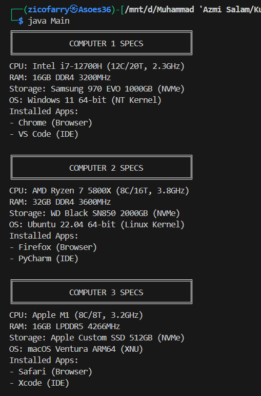

# Janji
Saya Muhammad 'Azmi Salam dengan NIM 2406010 mengerjakan Tugas Praktikum 3 pada Mata Kuliah Desain dan Pemrograman Berorientasi Objek (DPBO) untuk keberkahan-Nya maka saya tidak melakukan kecurangan seperti yang telah dispesifikasikan. Aamiin

# Struktur File
```
Main
├── CPP/
│   ├── Program/
│   │   ├── Application.cpp
│   │   ├── Component.cpp
│   │   ├── Computer.cpp
│   │   ├── CPU.cpp
│   │   ├── HardDrive.cpp
│   │   ├── HardWare.cpp
│   │   ├── HDD.cpp
│   │   ├── OperatingSystem.cpp
│   │   ├── RAM.cpp
│   │   ├── SoftWare.cpp
│   │   ├── SSD.cpp
│   │   ├── Storage.cpp
│   │   └── main.cpp
│   │
│   └── Dokumentasi/
│       └── cpp.png
│
├── Java/
│   ├── Program/
│   │   ├── Application.java
│   │   ├── Component.java
│   │   ├── Computer.java
│   │   ├── CPU.java
│   │   ├── HardDrive.java
│   │   ├── HardWare.java
│   │   ├── HDD.java
│   │   ├── OperatingSystem.java
│   │   ├── RAM.java
│   │   ├── SoftWare.java
│   │   ├── SSD.java
│   │   ├── Storage.java
│   │   └── Main.java
│   │
│   └── Dokumentasi/
│       └── java.png
│
├── Python/
│   ├── Program/
│   │   ├── Application.py
│   │   ├── Component.py
│   │   ├── Computer.py
│   │   ├── CPU.py
│   │   ├── HardDrive.py
│   │   ├── HardWare.py
│   │   ├── HDD.py
│   │   ├── OperatingSystem.py
│   │   ├── RAM.py
│   │   ├── SoftWare.py
│   │   ├── SSD.py
│   │   ├── Storage.py
│   │   └── main.py
│   │
│   └── Dokumentasi
│       └── py.png
│
├── Diagram.png
└── README.md
```

# Diagram


# Desain
Program mencakup __12__ class, yaitu __Application__, __Component__, __Computer__, __CPU__, __HardDrive__, __HardDrive__, __HardWare__, __HDD__, __OperatingSystem__, __RAM__, __SoftWare__, __SSD__, dan __Storage__. 
Desain menerapkan konsep Object-Oriented Programming (OOP) dengan fitur berikut:

- __Inheritance__: `HDD` & `SSD` mewarisi `HardDrive`, `HardDrive` mewarisi `Storage` & `Hardware`, `Storage`, `CPU`, & `RAM` mewarisi `Component`, dan `Application` & `OperatingSystem` mewarisi `SoftWare`.
- __Composition__: Kelas `Computer` memiliki relasi composition dengan `CPU` dan `RAM`.
- __Aggregation__: Kelas `Computer` memiliki relasi agregasi dengan `Storage`, `OperatingSystem`, dan `Application`.
- __Array of Object__: `Computer` menyimpan banyak `Application` dalam bentuk array.
- __Hierarchical Inheritance__: `Storage`, `CPU`, & `RAM` mewarisi `Component`, `HDD` & `SSD` mewarisi `HardDrive`, dan `Application` & `OperatingSystem` mewarisi `Software`.
- __Multiple Inheritance__: `HardDrive` mewarisi `Storage` dan `Hardware`.
- __Hybrid Inheritance__: Kombinasi hierarchical dan multiple inheritance.

## Detail Kelas
Oke, aku sudah lihat diagram UML 12 kelas kamu. Aku bikinkan README.md dengan format yang sama seperti contohmu tadi 👇

---

# Computer System (OOP Design)

Program ini adalah implementasi desain sistem komputer menggunakan konsep **Object-Oriented Programming (OOP)** dengan inheritance, composition, dan aggregation.

## Detail Kelas

### Component
* `brand`: Merek komponen.
* `model`: Model komponen.

### Hardware
* `name`: Nama perangkat keras.
* `brand`: Merek perangkat keras.
* `price`: Harga perangkat keras.
* `warranty`: Masa garansi perangkat keras.

### Storage (Turunan dari Component)
* `capacity`: Kapasitas penyimpanan.
* `type`: Jenis penyimpanan (HDD/SSD/NVMe).

### HardDrive (Turunan dari Storage dan Hardware)
* `cache`: Ukuran cache penyimpanan.

### HDD (Turunan dari HardDrive)
* `RPM`: Kecepatan putaran hard disk.

### SSD (Turunan dari HardDrive)
* `readSpeed`: Kecepatan baca (MB/s).
* `writeSpeed`: Kecepatan tulis (MB/s).

### CPU (Turunan dari Component)
* `core`: Jumlah core.
* `thread`: Jumlah thread.
* `speed`: Kecepatan clock (GHz).

### RAM (Turunan dari Component)
* `size`: Kapasitas RAM (GB).
* `DDR`: Jenis DDR (DDR4/DDR5, dll).
* `frequency`: Kecepatan RAM (MHz).

### Software
* `name`: Nama software.
* `version`: Versi software.

### OperatingSystem (Turunan dari Software)
* `architecture`: Arsitektur sistem operasi (32-bit/64-bit/ARM).
* `kernel`: Kernel yang digunakan.

### Application (Turunan dari Software)
* `category`: Kategori aplikasi (Browser, IDE, dll).
* `license`: Jenis lisensi (Free/Paid).

### Computer
* `OS`: Sistem operasi yang digunakan.
* `CPU`: Prosesor komputer.
* `RAM`: Memori komputer.
* `Storage`: Media penyimpanan.
* `applications`: Daftar aplikasi yang terinstal.


# Dokumentasi
## C++
<div>
    
</div>

## JAVA
<div>
    
</div>

## PYTHON
<div>
    
</div>
